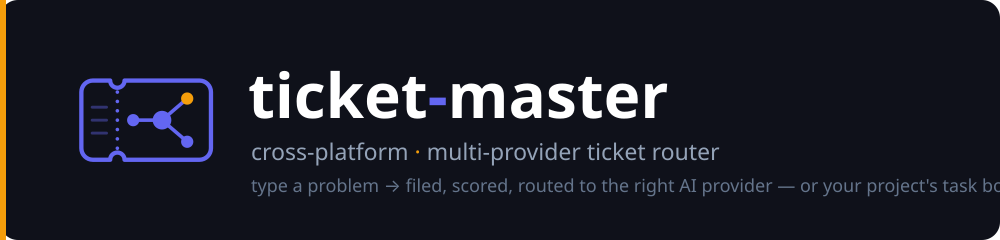
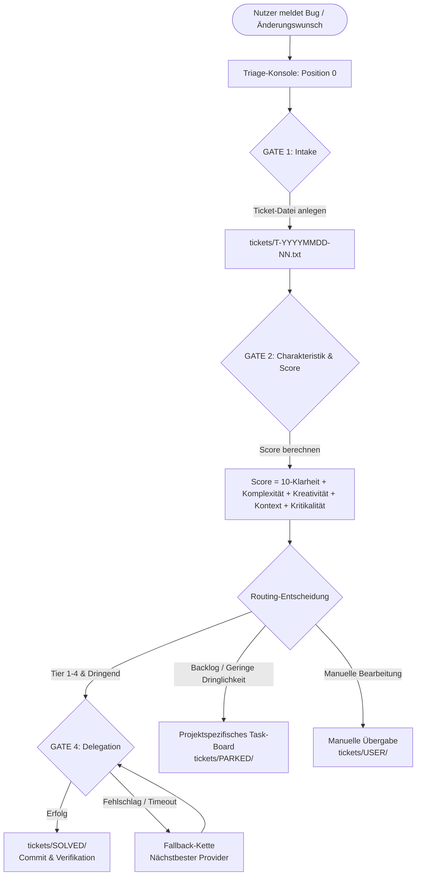
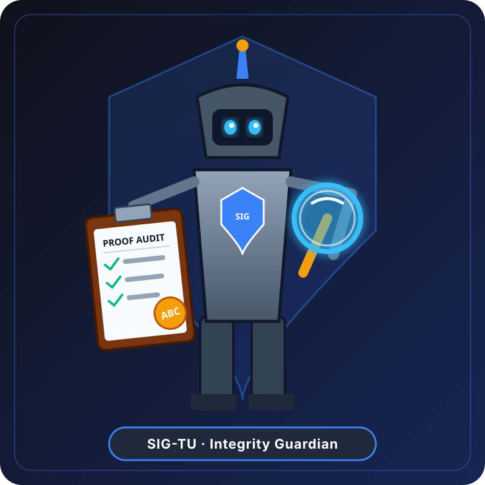

# ticket-master

Ein plattformübergreifender, multi-provider **Workflow / Betriebsmodus** für einen KI-Coding-Agenten.

ticket-master ist ein Workflow/Betriebsmodus für einen KI-Coding-Agenten, kein Tool,
das eigenständig handelt. Du hältst eine Agenten-Session (**„Position 0"**) in deinem
Terminal offen; sobald dir ein Bug, ein Änderungswunsch oder ein Projektproblem
auffällt, tippst du es einfach ein. Indem der Agent diesem Workflow folgt, nimmt er es
als strukturiertes Ticket auf, ordnet es dem richtigen Projekt zu, bewertet es und
routet es — entweder per Delegation an den besten verfügbaren KI-Provider/Subagenten
für einen Sofort-Fix, oder durch Einpflegen ins projekteigene Task-Management, wenn
Delegation nicht sinnvoll ist. Plattformübergreifend (Windows/macOS/Linux),
multi-provider (Claude Code, Codex, agy/Gemini).

[](LICENSE)
[](VERSION)
[](tests/)
[](pyproject.toml)
[](llms.txt)
[](#starter-matrix)

---

🇬🇧 [English documentation → README.md](README.md)

> [!NOTE]
> KI-Agenten und RAG-Indexer finden maschinenlesbare Kontextinformationen, Suchbegriffe und Einstiegspunkte in [llms.txt](llms.txt).

---

## Wie es funktioniert

ticket-master ist ein **prompt-gesteuerter Workflow**: Der Agent liest den
TICKET-MASTER-Prompt und folgt ihm. Jeder Schritt unten ist etwas, das der *Agent*
tut, indem er dem Prompt folgt — nichts läuft von selbst.

```
Du meldest einen Bug oder Änderungswunsch
        |
        v
[A] Intake — Ticket-Datei anlegen, Projekt zuordnen (GATE1)
        |
        v
[2-5] Charakteristik → Score → Provider-Abgleich → 3 Kandidaten (GATE2)
        |
        v
[B] Delegation an besten verfügbaren Provider (GATE4 + Fallback-Kette)
        |
   oder v
[C] Ins projektspezifische Task-Management einpflegen
        |
        v
Position 0 — Wartet auf das nächste Ticket
```



### Kernprinzipien (wie der Agent angewiesen wird, sich zu verhalten)

- **Lean Router:** Der Agent bleibt in diesem Modus schlank. Ausführung wird an
  Subagenten delegiert, die kompakt zurückmelden (Commit-Hash + eine Zeile).
- **Companion-Muster:** Für eine Ticket-Serie im gleichen Bereich spawnt der Agent
  einen Companion-Subagenten einmal und verwendet ihn wieder.
- **Score-basiertes Routing:** Der Agent bewertet jedes Ticket auf fünf Dimensionen
  (Klarheit, Komplexität, Kreativität, Kontext, Kritikalität), um den
  benötigten Provider-Tier zu bestimmen.
- **Graceful Fallback:** Wenn der bevorzugte Provider nicht verfügbar ist,
  stellt die Fallback-Kette des Prompts sicher, dass kein Ticket verloren geht.
- **Provider-agnostisch:** Funktioniert mit jedem CLI-basierten LLM-Provider.
  Prompt und Config bringen Unterstützung für Claude, Codex und agy (Gemini) mit.
  Erweiterbar per Config.
- **Cloud-Ready / Multi-System:** Die Ticket-Queue funktioniert auf mehreren
  Maschinen, die einen cloud-synced Ordner (OneDrive, Dropbox, Google Drive) teilen.
  Claims werden per Dateiname-Rename signalisiert — atomar auf NTFS, keine Lock-Dateien
  nötig.

---

## Rollen

<p align="center">
  
  &nbsp;&nbsp;
  
</p>

- **TICKET-MASTER**: Dünner Router und Verkehrsleiter. Verteilt eingehende Tickets ruhig an spezialisierte Subagenten oder Projektaufgaben-Boards.
- **TICKET-WRITER („SIG-TU")**: System Integrity Guardian. Schildwache mit Lupe und Klemmbrett; prüft Belege strikt auf ABC-Qualitätsniveau.

---

## Schnellstart

```bash
# 1. Repository klonen
git clone https://github.com/dev-bricks/ticket-master.git
cd ticket-master

# 2. Config kopieren und anpassen
cp config/ticket-master.config.example.json config/ticket-master.config.json
# -> config/ticket-master.config.json bearbeiten:
#    - Eigene Projektordner in project_roots[] eintragen
#    - Provider-Befehle prüfen (stimmen sie mit den installierten CLIs überein?)

# 3. Starten (Standard: Claude)
./bin/ticket-master.sh               # Unix/macOS
.\bin\ticket-master.bat              # Windows CMD
.\bin\ticket-master.ps1              # Windows PowerShell
```

Das startet deinen gewählten CLI-Provider mit dem TICKET-MASTER-Prompt der
gewählten Sprache (`prompts/TICKET-MASTER.<lang>.md`, Standard Englisch). Der Agent
liest den Prompt, orientiert sich an deinen Projekten und geht auf **Position 0** —
wartet still auf dein erstes Ticket.

### Prompt-Sprache

Der Agenten-Prompt liegt in zwei vollwertigen, inhaltsgleichen Versionen vor:

- `prompts/TICKET-MASTER.en.md` (Englisch, Standard)
- `prompts/TICKET-MASTER.de.md` (Deutsch)

Die Sprache wird über die Umgebungsvariable `TM_LANG` gewählt; die Starter laden
`prompts/TICKET-MASTER.${TM_LANG}.md` und fallen mit einer Warnung auf Englisch
zurück, falls die angeforderte Datei fehlt. Das Config-Feld `default_language`
dokumentiert den vorgesehenen Standard.

```bash
TM_LANG=de ./bin/ticket-master.sh        # Deutscher Prompt
TM_LANG=en ./bin/ticket-master.sh        # Englischer Prompt (Standard)
```

```powershell
$env:TM_LANG = "de"; .\bin\ticket-master.ps1
```

---

## Starter-Matrix

| Betriebssystem | Provider | Befehl |
|----------------|----------|--------|
| Unix / macOS | Claude | `./bin/start-claude.sh` |
| Unix / macOS | Codex | `./bin/start-codex.sh` |
| Unix / macOS | agy (Gemini) | `./bin/start-agy.sh` |
| Windows CMD | Claude | `bin\start-claude.bat` |
| Windows CMD | Codex | `bin\start-codex.bat` |
| Windows CMD | agy (Gemini) | `bin\start-agy.bat` |
| Windows PowerShell | Claude | `.\bin\ticket-master.ps1 -Provider claude` |
| Windows PowerShell | Codex | `.\bin\ticket-master.ps1 -Provider codex` |
| Windows PowerShell | agy (Gemini) | `.\bin\ticket-master.ps1 -Provider agy` |

### Umgebungsvariablen

| Variable | Standard | Wirkung |
|----------|----------|---------|
| `TM_PROVIDER` | `claude` | Provider ohne Flag überschreiben |
| `TM_LANG` | `en` | Prompt-Sprache; lädt `prompts/TICKET-MASTER.${TM_LANG}.md` (Fallback `en`) |
| `TM_SKIP_PERMISSIONS` | `0` | Auf `1` setzen, um `--dangerously-skip-permissions` an Claude zu übergeben |

---

## Konfiguration

`config/ticket-master.config.example.json` nach
`config/ticket-master.config.json` kopieren (die echte Config ist per
`.gitignore` ausgeschlossen).

### Wichtige Felder

| Feld | Beschreibung |
|------|--------------|
| `tickets_dir` | Wo Ticket-Dateien liegen (Standard: `./tickets`) |
| `default_language` | Dokumentierte Standard-Promptsprache (`en`/`de`); Laufzeit-Override via `TM_LANG` |
| `project_roots[]` | **Deine Projekte** — Name, Pfad und Pipeline für jeden Eintrag |
| `providers.claude` | Claude-CLI-Konfiguration |
| `providers.codex` | Codex-CLI-Konfiguration |
| `providers.agy` | Gemini-CLI-Konfiguration |
| `advisor.enabled` | Advisor-Modell für kritische Tickets (Score ≥ 35) aktivieren |
| `router_command` | Optional: externer Multi-Modell-/Task-Router, primär vor der Score-Fallback-Formel |
| `task_db_command` | Optional: „später"-Senke für `woche`/`backlog`-Tickets |

---

## Auffindbarkeit und Abgrenzung

Nutze beim Suchen den kanonischen Namen **`dev-bricks/ticket-master`**. Dieses
Repository ist ein **LLM-Ticket-Router**: ein prompt-gesteuerter Triage-Workflow,
mit dem eine Coding-Agent-Session Bugs aufnimmt, bewertet, einen Claude-/Codex-/
agy-Provider auswählt und den Ticketverlauf nachvollziehbar hält.

Gute Suchphrasen:

```text
dev-bricks ticket-master
LLM Ticket Router Agent
KI Coding Agent Triage Konsole
Claude Codex Gemini Ticket Routing
Multi-Provider LLM Task Router
Prompt-gesteuerter Issue Intake Workflow
Companion Pattern KI Agent Workflow
```

Nicht gemeint sind Ticketmaster-Event-APIs, Konzertticket-Bots, Helpdesk-SaaS,
Customer-Support-Tickets, Ticket-Resale-Marktplätze oder ein eigenständiger
Bugtracker, der ohne aktive LLM-Agenten-Session Issues anlegt.

## Wie das Routing funktioniert

### Score-Formel

```
SCORE = (10 - KLARHEIT) + KOMPLEXITÄT + KREATIVITÄT + KONTEXT + KRITIKALITÄT
```

Jede Dimension: 0–10. Gesamt: 0–50.

| Score | Tier | Typischer Einsatz |
|-------|------|-------------------|
| 0–8 | Tier 1 | Schnell/günstig — Boilerplate, Formatierung |
| 9–12 | Tier 2 | Standardfähig — Bugs, Dokumentation |
| 13–28 | Tier 3 | Fähiger Coder/Researcher — komplexe Bugs, Code-Review |
| 29–50 | Tier 4 | Architekt/Reviewer — Design, Beweise, kritische Änderungen |

---

## Verzeichnisstruktur

```
tickets/
├── _logs/                      <- DEPRECATED geteiltes Intake-Log (vor 1.5.0)
│   └── INTAKE-TRIAGE-LOG.txt
├── _templates/TICKET.txt       <- Ticket-Vorlage
├── *.txt                       <- offene Tickets (je eine .txt-Datei)
├── INBOX/                      <- neu eingegangen, noch nicht triagiert (Root = Alias)
├── ACTIONABLE/                 <- sofort umsetzbar: kein Blocker, keine User-Abhängigkeit
├── QUEUED/                     <- an Provider übergeben, Ergebnis ausstehend
├── BLOCKED/                    <- externer Blocker (host-receipt / foreign-state / lock / quota / dependency)
├── WAITING/                    <- zeit-/marker-gebunden (scheduled / review-due / marker)
├── USER/                       <- hängt zwingend am User (decision / data / freigabe / hardware / session)
├── PARKED/                     <- bewusst zurückgestellt (skip / backlog / until-trigger)
├── SOLVED/                     <- gelöst und empirisch bestätigt
├── PENDING/                    <- LEGACY-Alias (vor v1) — lesbar, keine neuen Einträge
└── .USER/                      <- LEGACY-Alias (vor v1) — abgelöst durch USER/
```

Das vollständige Kategorien-Modell (Ein-/Ausgangsregeln, Autonomie-Loop,
STATUS-Spiegelung) steht in [docs/CATEGORIES.de.md](docs/CATEGORIES.de.md)
([English](docs/CATEGORIES.en.md)).

Der Audit-/Triage-Trail lebt **pro Ticket** in der Ticketdatei selbst
(Felder `STATUS` / `VERLAUF` / `LOESUNG`). Triviale, sofort erledigte und
verifizierte Tickets bekommen eine **minimale** Ticketdatei direkt in
`tickets/SOLVED/`. Das frühere geteilte `tickets/_logs/INTAKE-TRIAGE-LOG.txt`
ist **deprecated**: Wenn mehrere Maschinen an eine cloud-synchronisierte Datei
anhängen, fressen Konfliktkopien Log-Zeilen.

## Cloud-Ready: Multi-System Claim-Konvention

Wenn das `tickets/`-Verzeichnis in einem cloud-synced Ordner liegt, der von
mehreren Maschinen geteilt wird, werden Claims per **Dateiname** signalisiert —
kein In-File-Feld, keine Lock-Dateien nötig:

| Zustand    | Dateiname-Muster             | Beispiel                         |
|------------|------------------------------|----------------------------------|
| Unclaimed  | `T-YYYYMMDD-NN.txt`         | `T-20260619-01.txt`              |
| Claimed    | `T-YYYYMMDD-NN.<HOST>.txt`  | `T-20260619-01.WORKSTATION.txt`  |
| Gelöst     | nach `SOLVED/` verschieben   | wie bisher                       |

**Glob-Muster:** `tickets/T-??????-??.txt` (unclaimed) · `tickets/T-*.LAPTOP.txt` (meine).

Ein Rename im selben Verzeichnis ist auf NTFS und den meisten Cloud-Sync-Implementierungen
atomar. Entsteht eine Konfliktkopie, hat ein System den Claim gewonnen; das andere rollt
zurück und nimmt das nächste unclaimed Ticket.

---

## Personal-Assistant-Ausbau (optional): Domänen-Map, Dringlichkeit & Delegation

Drei optionale Schichten machen aus dem reinen Ticket-Router eine kleine
persönliche Assistenz-Triage-Konsole, aufbauend auf einem BACH-artigen
Personal-Assistant-Install:

- **Domänen-Map (1.6.0, erweitert 1.8.0):** `lib/domains_generator.py`
  generiert `config/domains.json` — eine Domäne→Experten-Map, gegen eine
  Skill-Registry abgeglichen, um bereits als Standalone-Skill existierende
  Experten zu markieren. Nur zur Generierungszeit wird BACH gebraucht;
  `config/domains.json` selbst ist zur Laufzeit eine reine, BACH-freie
  JSON-Datei. `experts[]` ist NUR Herkunfts-/Gruppierungs-Metadaten — der
  Prompt routet direkt auf den/die aufgelösten Skill(s), nie über den
  Experten als Zwischen-Hop. Seit 1.8.0 erkennt ein Stage-2-Fuzzy-Durchlauf
  (`fuzzy_match_skills()`, plus optional `--extra-skills-dir` als zweiter
  Skill-Bestand) zusätzlich Experten, die eine ganze Skill-FAMILIE regieren
  (`"status": "teilportiert"`, `"matched_skills"`: eine Liste) statt eines
  einzelnen 1:1-portierten Skills. Schema: `config/domains.example.json`.
- **Dringlichkeitsachse (1.7.0):** `config/urgency.json` (Schema:
  `config/urgency.example.json`) ordnet jeder Domäne eine Default-Frist zu
  (`sofort` / `heute` / `woche` / `backlog`) plus Eskalationsregeln (z.B.
  eskaliert veröffentlichte Software + ein schwerer Bug auf `sofort` und
  schickt bei unklarer Schwere zunächst nur einen Diagnose-Subagenten los).
  Diese Achse ist **entkoppelt** vom 5-Dimensionen-Komplexitäts-Score — ein
  Ticket kann niedrigen Score haben und trotzdem dringend sein, oder
  umgekehrt. Grenzfälle können optional einen konfigurierten
  Präferenz-Hinweis konsultieren (`preference_model_hint.command`); niedrige
  Konfidenz bedeutet immer: den User fragen statt raten.
- **Delegations-Verdrahtung (1.7.0, erweitert 1.8.0):** Das Intake-Gate des
  Prompts löst für eine getroffene Domäne einen `ENDPOINT` auf (über
  `domains.json`, dann optionale Skill-Registry-Tools, dann eine LÜCKEN-
  Markierung statt stillem Fallback); die Modellwahl bevorzugt einen
  optionalen externen `router_command` vor der eingebauten Score-Formel-
  Fallback-Logik; eine Rechteprüfung gegen `LOCK*.txt`-/
  `LOCK.permissions.json`-artige Konventionen läuft vor jedem Worker-Spawn;
  und Tickets mit Dringlichkeit `woche`/`backlog` werden an eine optionale
  „später"-Senke (`task_db_command`) übergeben, statt einen Subagenten zu
  spawnen. Seit 1.8.0 bekommt der Worker bei `"teilportiert"` ALLE Skills
  aus `matched_skills` mit, nicht nur den ersten — ein Experte kann eine
  ganze Skill-Familie regieren (siehe Domänen-Map-Abschnitt oben).
- **Wissens-Schicht (1.9.0):** `config/knowledge.json` (Schema:
  `config/knowledge.example.json`) listet Wissensquellen in vier
  Kategorien — `maps` (strukturell, beim Boot geladen), `state` (ändert
  sich während der Session, vor jeder Routing-Entscheidung neu geprüft),
  `capabilities` (bei Endpunkt-/Modell-Lookup konsultiert) und `user_model`
  (Präferenz-Hinweis, nur bei echten Grenzfällen). Grundregel: generierten
  Karten vertrauen, nicht dem Gedächtnis — bei Widerspruch die Karte neu
  generieren lassen statt der Erinnerung zu vertrauen.

Details siehe `CHANGELOG.md` (1.6.0–1.9.0).

---

## Voraussetzungen

- Mindestens ein CLI-basierter LLM-Provider (`claude`, `codex` oder `agy`)
- Python 3.10+ (nur für Tests; der Router selbst läuft in der LLM-Session)

---

## Smoke-Tests ausführen

```bash
python tests/test_smoke.py
```

Prüft: Verzeichnisstruktur vollständig, Config-JSON valide, Prompt enthält
keine verbotenen absoluten Pfade oder systemspezifischen Begriffe.

---

## Teil der ellmos-Stack-Familie

ticket-master ist bewusst beides: ein eigenständiges Dev-Tool und ein Kernmodul
der ellmos-Stack-Familie.

Kernmodul von [ellmos-ai/agent-ops-stack](https://github.com/ellmos-ai/agent-ops-stack)
(Rolle `ticket-routing`); Familie/Katalog: [ellmos-ai/stacks](https://github.com/ellmos-ai/stacks);
Org-Übersicht: [ellmos-ai](https://github.com/ellmos-ai).

---

## Lizenz

MIT License — Copyright (c) 2026 Lukas Geiger. Siehe [LICENSE](LICENSE).

## Autor

Lukas Geiger ([github.com/lukisch](https://github.com/lukisch))
